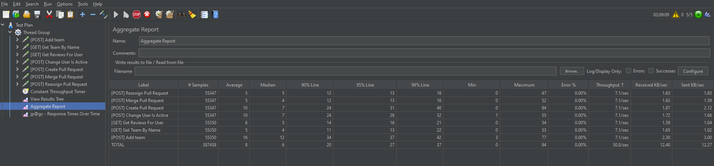

# **Микросервис для назначения ревьюеров на pull-request-ы**

## **Задание**
Проект сделан по [этому](https://github.com/avito-tech/tech-internship/blob/main/Tech%20Internships/Backend/Backend-trainee-assignment-autumn-2025/Backend-trainee-assignment-autumn-2025.md) заданию.
Спецификация для разработки backend-а находится [здесь](https://github.com/avito-tech/tech-internship/blob/main/Tech%20Internships/Backend/Backend-trainee-assignment-autumn-2025/openapi.yml).
___
## **Сборка**
Для ручной сборки исполняемого jar-архива из исходного кода при наличии JDK 17+ в системе нужно выполнить следующие действия:

### Linux
Перейти в директорию с проектом и выполнить команду:
```bash
./mvnw package
```

### Windows
Открыть терминал, перейти в папку с проектом и ввести команду:
```cmd
mvnw package
```
###
Собранный файл появится в корневой папке проекта.
Также можно скачать скомпилированный jar-архив [по этой ссылке](https://github.com/Groman-s/Avito-PullRequests-Microservice/releases/tag/v0.0.1).
___

## **Запуск микросервиса**

Микросервис запускается через Docker. Для начала нужно убедиться, что есть доступ к исполняемому jar файлу. Если он был скачан вручную, нужно переместить его
в корневую папку проекта (туда, где лежит Dockerfile).

После того как Вы убедитесь, что в корневой папке проекта есть исполняемый jar-файл микросервиса, выполните следующую команду:

```bash
docker-compose up -d
```

Если всё пройдёт успешно, сервис будет доступен на порту `8080`.
___

## **Выполненные дополнительные задания**

### Эндпоинт статистики ###
Добавлен эндпоинт `/team/pullRequestsCount`, принимающий в качестве параметра имя команды.
Возвращает статус `200` и количество пулл-реквестов всей команды или статус `400`, если
команда с указанным именем не существует.

Пример запроса:
```bash
curl "http://localhost:8080/team/pullRequestsCount?team_name=team3"
```

### Эндпоинт деактивации всей команды ###
Добавлен эндпоинт `/team/deactivateAllUsers`, принимающий в теле запроса имя команды.
Возвращает статус `200` с именем команды и списком её пользователей (они все будут деактивированы) или статус `400`, если
команда с указанным именем не существует.

Пример запроса:
```bash
curl -X POST http://localhost:8080/team/deactivateAllUsers -H "Content-Type: application/json" -d "{\"team_name\": \"team3\"}"
```


### Нагрузочное тестирование ###
Микросервис был протестирован под нагрузкой с использованием `Apache Jmeter`. Проверялся микросервис под нагрузкой
100 запросов в секунду в течение 2 часов.

#### **___Краткая сводка___**:
* Среднее время ответа: 9 мс
* SLI успешности: 100%
* 99% запросов выполнились быстрее 41 мс

#### **___Отчёт о нагрузочном тестировании (Aggregate Report)___**:



План нагрузочного тестирования для Jmeter можно найти в папке `jmeter` - файл `plan.jmx`.
